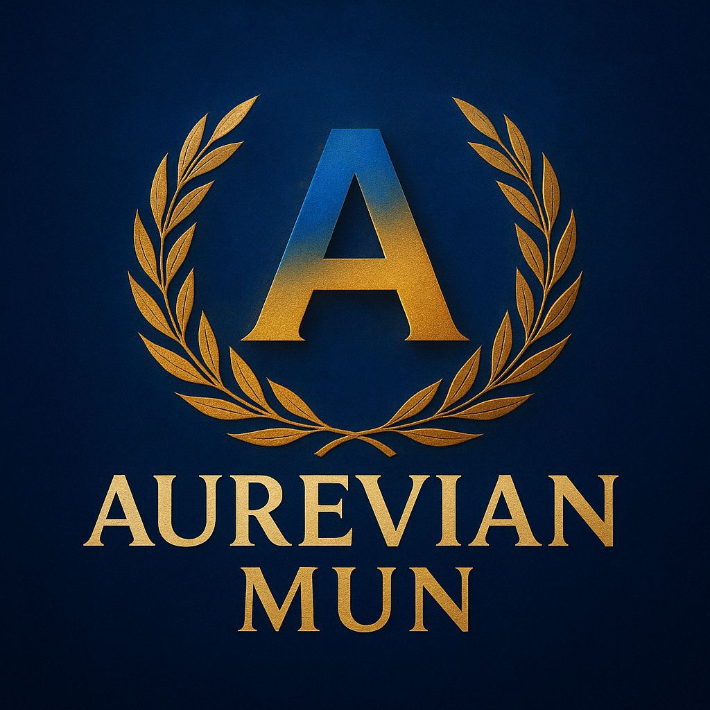

[index.html](https://github.com/user-attachments/files/23566324/index.html)
<!DOCTYPE html>
<html lang="en">
<head>

<meta charset="UTF-8">
<meta name="viewport" content="width=device-width, initial-scale=1.0">
<title>Aurevian MUN - Home</title>

</head>

<body>

    

        <!-- GLOWING LOGO CIRCLE -->
        

            
        

        <h1>Aurevian MUN</h1>
        
Welcome To The Official Homepage

        <!-- BUTTONS -->
        <a href="registration.html" class="big-button">1 Registration Form</a>

        

            <a href="teams.html" class="small-button">2 Teams</a>
            <a href="terms.html" class="small-button">3 Terms & Conditions</a>
            <a href="https://instagram.com/" target="_blank" class="small-button">4 Instagram Handle</a>
        

    

<footer>
    Created by Mridul Kapoor
</footer>

</body>
</html>

<!DOCTYPE html>
<html lang="en">
<head>
<meta charset="UTF-8">
<title>Aurevian MUN – Registration Form</title>

</head>
<body>

    <h1>Aurevian MUN Registration</h1>

    <form id="regForm" enctype="multipart/form-data">

        <label>Name</label>
        <input type="text" name="name" required>

        <label>Phone Number</label>
        <input type="tel" name="phone" required>

        <label>Alternate Phone Number (Optional)</label>
        <input type="tel" name="alt_phone">

        <label>School / Institution</label>
        <input type="text" name="school">

        <label>Email ID</label>
        <input type="email" name="email" required>

        <label>Select Team</label>
        <select name="team" id="teamSelect" required></select>

        <label>UPI Payment ID</label>
        <input type="text" name="upi" value="8595635419@pthdfc" readonly>

        <label>Upload Payment Proof</label>
        <input type="file" name="payment" accept="image/*" required>

        <label>Reference (If Any)</label>
        <input type="text" name="reference">

        <label><input type="checkbox" required> I agree to all Terms & Conditions</label>

        <button type="submit">Submit</button>
    </form>

// Submit form data
document.getElementById("regForm").addEventListener("submit", async (e) => {
    e.preventDefault();

    const formData = new FormData(e.target);
    const res = await fetch("/register", {
        method: "POST",
        body: formData
    });

    const data = await res.json();
    alert(data.message);
    if (data.success) loadTeams();
});

loadTeams();
</script>

</body>
</html>

